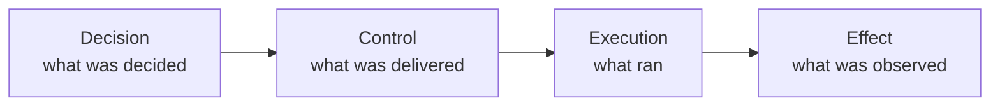

# AI Runtime Evidence Protocol (AIREP)

[](https://github.com/halvrenofviryel/ai-runtime-evidence-protocol/actions/workflows/conformance.yml)
[](https://github.com/halvrenofviryel/ai-runtime-evidence-protocol/actions/workflows/v0.2-beta.yml)
[](https://doi.org/10.5281/zenodo.20475136)
[](./LICENSE)
[](./LICENSE-CC-BY-4.0.txt)

**Open, vendor-neutral runtime evidence for AI decisions, control delivery, execution, and observed effects. Signed, hash-linked, offline-checkable.**



**[Run the demo](#one-command-demo) · [Read the v0.2 specification](spec/airep/v0.2/SPEC.md) · [Read the paper](https://arxiv.org/abs/2608.21363) · [Open in Codespaces](https://codespaces.new/halvrenofviryel/ai-runtime-evidence-protocol?quickstart=1)**

> **Status: Experimental.** AIREP is a proposed open format with a first-party reference
> implementation. It is **not** a ratified standard, and a valid record does not establish that
> its reported event is true. See the [maturity and change-control status](spec/airep/v0.1/STATUS.md).

AIREP separates runtime evidence into four correlated artifact families so different components can
record what they observed at each lifecycle boundary. Explicit references and digests bind those
artifacts together. Structured reconciliation preserves `FAILURE`, `MISSING`, `NOT_EVALUATED`, and
`INDETERMINATE` instead of converting absent evidence into success.

## One-command demo

From a fresh clone with Python 3.12, Node 20, and GNU Make:

```bash
make demo
```

The command prepares pinned dependencies, runs a real local Decision → Control → Execution → Effect
lifecycle, verifies it with the Python and Node paths, and derives this summary from the reconciler's
JSON output:

```text
COMPLETE SUPPLIED LIFECYCLE
  Receiver receipt          SATISFIED
  Execution evidence        SATISFIED
  Intended-target coverage  NOT_EVALUATED
  Overall                   INCOMPLETE

MISSING-RECEIPT VARIANT
  Receiver receipt    MISSING
  Execution evidence  MISSING
  TOCTOU comparison   NOT_EVALUATED
  Overall             INCOMPLETE
```

Exit zero means the evaluation completed; negative or withheld governance states remain visible in
the JSON and summary. `MISSING` is not proof that delivery or execution did not occur. The generated
artifacts are retained under `.airep-demo/runs/`. See the [full quickstart](spec/airep/v0.2/QUICKSTART.md).

## What has actually been independently reproduced?

| Target | Independent role | Observed result | Does not establish |
|---|---|---|---|
| frozen v0.1.2 | independently authored producer | accepted on first invocation by both pinned v0.1.2 reference verifiers | general interchange or deployment interoperability |
| v0.2 handoff corpus v0.1 | independently implemented consumer/verifier | 17 AGREE / 1 DISAGREE; the disagreement exposed an expected-projection defect | a same-version v0.2 producer→consumer interoperability result |

The results target different frozen versions and **must not be combined** into an interoperability
claim. The exact artifacts, reproduction steps, qualifications, and non-claims are recorded in
[EXTERNAL_EVIDENCE.md](EXTERNAL_EVIDENCE.md).

> **Current v0.2 implementation target: `v0.2.0-beta.1`.** The beta includes a first-party Python
> producer for all four artifact families, structured reconciliation, and Python/Node
> admission/profile verification. It is experimental and **not stable**. **v0.1 remains frozen and
> supported** under its own unchanged verification rules. See [beta readiness](spec/airep/v0.2/BETA_READINESS.md).
>
> **Start v0.2 here:** [specification](spec/airep/v0.2/SPEC.md) →
> [producer quickstart](spec/airep/v0.2/QUICKSTART.md) →
> [verifier](spec/airep/v0.2/VERIFICATION.md) → [lifecycle example](examples/v02/README.md).
> The `v0.1 conformance` badge is v0.1-specific; the `v0.2 beta implementation` badge is the beta's
> own workflow. A green workflow is first-party test evidence, not an interoperability result.

The earlier v0.1 line represents one governance decision as a signed, hash-chained record — an
**AI decision receipt**. In v0.2, that phrase describes the Decision artifact, not the whole protocol.

**Canonical home:** <https://github.com/halvrenofviryel/ai-runtime-evidence-protocol> — the schema
`$id`s resolve as raw files under its `main` branch.

> **Publication update.** Paper revised substantially in arXiv v2 (16 September 2026): four-family
> Decision–Control–Execution–Effect model, deterministic wire/integrity construction, bounded
> assurance semantics, lifecycle reconciliation, updated implementation/external-evidence status,
> and non-normative Hermes/LightEval integration exercises. [Read arXiv:2608.21363](https://arxiv.org/abs/2608.21363).

## What v0.2 records

The v0.2 beta gives Decision, Control, Execution and Effect their own artifact schemas. They correlate
by explicit references and digests, allowing a verifier to reconcile the lifecycle without treating
missing, withheld or unevaluated evidence as success. Their fields and meanings are defined in
[the v0.2 specification](spec/airep/v0.2/SPEC.md).

The v0.2 Decision artifact and frozen v0.1 decision record describe one decision: who decided and when (`subject`), what was decided on
(`input`), the claim and its basis (`claim`), the result (`output`), the supporting pointers
(`evidence`), the decision as one verb (`directive`), an honest statement of what it does and does
**not** cover (`scope`), and a tamper-evident stamp — hash, signature, and a chain link to the
previous record (`integrity`). Content stays out of the record: the question, answer, and evidence
are referenced by pointer and hash, so a record can be kept and shared without exposing regulated
data. Vendor-, model-, or domain-specific detail lives only under an optional `profiles` block, and
a **neutrality test** proves nothing leaked into the shared core.

A verified signature binds an artifact to a verifier-accepted key and makes later changes
detectable. The v0.2 assurance ladder — AIREP-Core, AIREP-Authenticated and AIREP-Witnessed —
concerns provenance, integrity and freshness. It does not establish event truth or the correctness
of a decision; `scope.does_not_cover` keeps that boundary explicit.

## Who is this for — start here

It is an **Experimental** proposed open format with a reference implementation — see
[`STATUS.md`](./spec/airep/v0.1/STATUS.md). The paths below refer to the **frozen v0.1** line;
for the v0.2 beta implementation target start at [`spec/airep/v0.2/SPEC.md`](./spec/airep/v0.2/SPEC.md)
and the [quickstart](./spec/airep/v0.2/QUICKSTART.md). Pick your path:

- **Reviewing / evaluating frozen v0.1?** Read [`EXPLAINER.md`](./spec/airep/v0.1/EXPLAINER.md) (plain-language
  tutorial, **start here**) and [`THREAT_MODEL.md`](./spec/airep/v0.1/THREAT_MODEL.md) (every threat
  graded honestly — `partial`/`none`, never "defended"). Then prove it yourself: `cd spec/airep/v0.1
  && pip install jsonschema cryptography` (Node 20+ also required), then `python3
  conformance/validate.py` and `python3 conformance/verify.py examples/chain.jsonl --pubkey
  examples/test_public_key.txt --class` — two cross-language first-party verifier implementations re-derive every hash byte-for-byte
  and you'll see `sig=ok`.
- **Adopting it (writing your own records)?** Follow **"Write your own record in 5 minutes"** in
  [`EXPLAINER.md`](./spec/airep/v0.1/EXPLAINER.md): copy
  [`examples/neutral_record.json`](./spec/airep/v0.1/examples/neutral_record.json), edit the fields,
  sign with your **own** key via [`producers/python/`](./producers/python/), and verify it. A custom
  `profiles.<name>` block works with **no upstream registration** — see
  [`profiles/README.md`](./spec/airep/v0.1/profiles/README.md) "Authoring your own profile".
- **Here for the delivery problem?** Read
  [`profiles/control_delivery.schema.json`](./spec/airep/v0.1/profiles/control_delivery.schema.json)
  and the worked example
  [`examples/control_delivery_failure.json`](./spec/airep/v0.1/examples/control_delivery_failure.json).
  A record format can say a stop was *decided*. Whether it *arrived* at the component that enforces
  it is a different fact, and an instruction that was correctly issued, correctly signed, and never
  delivered is indistinguishable from one nobody sent. This profile records both sides of the
  boundary so the gap between them is visible rather than silent — and it is honest that no single
  side can prove non-delivery alone, because a receiver cannot know what it never received. The
  example is a failure, not a success, and it came from a measured incident. How this relates to
  prior art, and where other formats are ahead of AIREP, is set out in
  [`STATUS.md`](./spec/airep/v0.1/STATUS.md).

- **Want to measure what your own system records?** [`cde12/`](./cde12/) holds **CDE-12**, an
  instrument for reporting what a system can and cannot record about a control decision — twelve
  criteria with pass conditions and evidence tiers fixed before any system was examined — and a
  dataset applying it to ten systems. It is deliberately **not part of this specification**: a format
  evaluated by criteria defined in its own spec would not be evaluated at all. AIREP appears in the
  dataset as one row among others, scored by its own authors and last, and the Phionyx control plane
  appears as a second row because a format's capability is not a deployment's practice.

- **Contributing?** Read [`CONTRIBUTING.md`](./CONTRIBUTING.md), browse the
  [`good first issue`](../../labels/good%20first%20issue) and [`help wanted`](../../labels/help%20wanted)
  labels (the open items from [`STATUS.md`](./spec/airep/v0.1/STATUS.md) are filed there), and report
  verifier / crypto flaws privately via [`SECURITY.md`](./SECURITY.md). Independently authored
  producers, independent consumers/verifiers, and adversarial cross-implementation testing are all
  wanted — see [`EXTERNAL_EVIDENCE.md`](./EXTERNAL_EVIDENCE.md) for what has been measured so far
  and against which frozen version. The release-pinned
  [independent v0.2 producer challenge](https://github.com/halvrenofviryel/ai-runtime-evidence-protocol/issues/62)
  treats compatible output, a reproducible divergence, or a specification ambiguity as useful evidence.

### Related technical note

**Access Is Not Yet Verifiability: Toward a Claim-Preserving Evidence Contract for AI Assurance**

A technical position paper on preserving the scope and limitations of runtime-evidence claims as they
pass through verifiers, adapters, dashboards and third-party evaluation reports.

[Read on Hugging Face →](https://huggingface.co/blog/phionyx/access-is-not-yet-verifiability)

It is not part of the AIREP specification and does not change AIREP conformance; it uses AIREP as one
concrete source of stage-specific evidence semantics.

### Related standards work

[Claim-Preserving Exchange of AI Evaluation Evidence](https://datatracker.ietf.org/doc/draft-abak-ai-evaluation-claim-preservation/)
is an individual Informational Internet-Draft authored by Ali Toygar Abak. It is not WG-adopted and
addresses format-neutral preservation of AI evaluation claims. The draft cites AIREP Embedded
Evaluation Profile 0.1 as informative related work; publication does not change AIREP conformance or
maturity and is not evidence of AIREP adoption or standardization.

## Repository map

| Path | What it is |
|------|------------|
| [`spec/airep/v0.2/SPEC.md`](./spec/airep/v0.2/SPEC.md) | **Start v0.2 here.** Consolidated normative beta implementation specification. |
| [`tools/airep_v02/`](./tools/airep_v02/) | First-party four-family v0.2 producer, verifier adapters and reconciler. |
| [`examples/v02/`](./examples/v02/) | Real local lifecycle and committed negative variants. |
| [`spec/airep/v0.2/profiles/embedded-evaluation/`](./spec/airep/v0.2/profiles/embedded-evaluation/) | Experimental Embedded Evaluation Profile v0.1 — evaluation identity, access, configuration, explicit measurement state, evidence provenance and verification references. A companion profile on the `profiles` extension surface, not a fifth artifact family; a profile PASS is not an assurance class. Hugging Face: [dataset mirror](https://huggingface.co/datasets/phionyx/airep-embedded-evaluation-profile) · [exporter Space](https://huggingface.co/spaces/phionyx/airep-evaluation-evidence). |
| [`integrations/lighteval/`](./integrations/lighteval/) | Non-normative, first-party AIREP integration exercise: hashes LightEval `results_*.json` (and supplied details/log files) into an Embedded Evaluation Profile payload plus evidence manifest. It is not external adoption, third-party endorsement or interoperability evidence. |
| [`integrations/hermes/`](./integrations/hermes/) | Non-normative Hermes approval/runtime → AIREP v0.2 mapping and deterministic lifecycle fixtures: first-party AIREP integration evidence against an external runtime/source model, not independent Hermes adoption or interoperability. |
| [`spec/airep/v0.1/EXPLAINER.md`](./spec/airep/v0.1/EXPLAINER.md) | Plain-language tutorial. **Start here for frozen v0.1.** |
| [`spec/airep/v0.1/SPEC.md`](./spec/airep/v0.1/SPEC.md) | Normative specification — the binding rules. |
| [`spec/airep/v0.1/core.schema.json`](./spec/airep/v0.1/core.schema.json) | JSON Schema (draft 2020-12) for the core record. |
| [`spec/airep/v0.1/profiles/`](./spec/airep/v0.1/profiles/) | Optional binding profiles — **`control_delivery`** (did a control instruction *arrive*?), key trust, chain-witness/freshness, EU AI Act, NIST AI RMF, OWASP/threat, observability. |
| [`spec/airep/v0.1/conformance/`](./spec/airep/v0.1/conformance/) | Two cross-language first-party verifier implementations (Python + Node) and a runnable validator — frozen v0.1. |
| [`spec/airep/v0.1/examples/`](./spec/airep/v0.1/examples/) | Worked records with really-computed hashes + Ed25519 signatures, including a 5-record chain. |
| [`spec/airep/v0.1/THREAT_MODEL.md`](./spec/airep/v0.1/THREAT_MODEL.md) | What the format detects, how, and what it does not. |
| [`producers/python/`](./producers/python/) | Copy-paste producer — sign your own record with your own key. |
| [`EXTERNAL_EVIDENCE.md`](./EXTERNAL_EVIDENCE.md) | Independently authored implementations measured against frozen releases, with version and role boundaries. |

## Check it yourself (frozen v0.1)

```bash
cd spec/airep/v0.1
pip install jsonschema cryptography      # Python deps (Node 20+ also required for verify.mjs)
python3 conformance/validate.py          # full battery: schema, neutrality, integrity, chain, tamper
python3 conformance/verify.py  examples/chain.jsonl --pubkey examples/test_public_key.txt --class   # Python -> sig=ok
node      conformance/verify.mjs examples/chain.jsonl --pubkey examples/test_public_key.txt --class   # Node -> same bytes
```

Two implementations on different language and crypto stacks each validate structure, run the
neutrality test, re-derive every hash and agree on it byte-for-byte, and re-verify the signatures.
Two first-party implementations agreeing shows cross-language agreement on these selected inputs.
It is not, by itself, an independent same-version producer/consumer or deployment interoperability
result; [`EXTERNAL_EVIDENCE.md`](./EXTERNAL_EVIDENCE.md) records what has been measured independently,
and against which frozen version.

## Reference implementation

**AIREP v0.2.0-beta.1 ships its own first-party reference producer** for the four artifact
families ([`tools/airep_v02/`](./tools/airep_v02/)); for frozen v0.1 the copy-paste producer is
[`producers/python/`](./producers/python/). AIREP carries no Phionyx-specific physics, vocabulary,
or dependency — that is the point of the neutrality test.

The **Phionyx Reasoned Governance Envelope (RGE)** is a related runtime evidence source developed
alongside AIREP, not an AIREP producer. **Raw RGE records are not AIREP-conformant** — AIREP's own
reference verifier rejects an RGE envelope handed to it directly. **No publicly checkable released
RGE → AIREP projection is identified by this repository as of 14 September 2026.** Private
experimental projections are separate from the first-party AIREP producer and do not establish
public interoperability. A projection claim requires a named release, target version and
publicly checkable source and verification evidence.

An **independently authored v0.1 producer** has since been measured against frozen **v0.1.2**: its
records were accepted on first invocation by both pinned reference verifiers, and the experiment
independently exposed a real v0.1 ambiguity in the signature input and value encoding. That is one
compatibility result, not a general interchange property. **v0.2.0-beta.1 provides a first-party
reference producer for all four artifact families. No same-version third-party
v0.2 producer→consumer interoperability result exists.** Historical identities, commands and boundaries are recorded in
[`EXTERNAL_EVIDENCE.md`](./EXTERNAL_EVIDENCE.md).

## Contributing

See [`CONTRIBUTING.md`](./CONTRIBUTING.md). In short: the normative text and the conformance vectors
change in lockstep; breaking changes bump the version and are logged as **BREAKING** in `STATUS.md`.

## License

- **Specification text and schemas** (`spec/**/*.md`, `spec/**/*.schema.json`): **CC-BY-4.0** — see
  [`LICENSE-CC-BY-4.0.txt`](./LICENSE-CC-BY-4.0.txt).
- **Conformance and example code** (`spec/**/conformance/`, `spec/**/examples/`): **Apache-2.0** —
  see [`LICENSE`](./LICENSE).

## Patent Non-Assertion

AIREP is intended to be freely implementable as a neutral interoperability format. The maintainer
provides a royalty-free patent non-assertion covenant for implementations limited to producing,
transmitting, canonicalizing, hash-chaining, signing, or verifying conformant AIREP records as
defined by the neutral core specification.

This covenant does not license Phionyx runtime mechanisms, governance engines, scoring systems,
model-routing logic, or any implementation-specific technology beyond the acts necessary to implement
the neutral AIREP interchange record itself.

See [`PATENT_NON_ASSERTION.md`](./PATENT_NON_ASSERTION.md).

## Citation

Paper: *AIREP: A Protocol for Per-Decision Evidence in AI Runtime Governance*, revised substantially
in arXiv v2 on 16 September 2026 — [arXiv:2608.21363](https://arxiv.org/abs/2608.21363),
[DOI 10.48550/arXiv.2608.21363](https://doi.org/10.48550/arXiv.2608.21363) (preprint, not peer reviewed).

Existing Zenodo archives:

| Cite | DOI |
|---|---|
| All AIREP versions (concept) | [10.5281/zenodo.20475136](https://doi.org/10.5281/zenodo.20475136) |
| **v0.1** — the stable, recommended target | [10.5281/zenodo.20475137](https://doi.org/10.5281/zenodo.20475137) |
| **v0.2.0-alpha.1** — experimental prerelease | [10.5281/zenodo.22101986](https://doi.org/10.5281/zenodo.22101986) |

Cite the paper for the protocol, and the version DOI for the exact artifact you used.
For beta, use the [v0.2.0-beta.1 release](https://github.com/halvrenofviryel/ai-runtime-evidence-protocol/releases/tag/v0.2.0-beta.1)
and its exact tag until a new beta version DOI is recorded there. The alpha DOI
does not identify beta artifacts.
Machine-readable metadata is in [`CITATION.cff`](./CITATION.cff).
