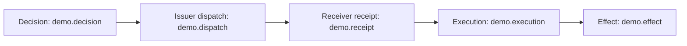

# Decision → Control → Execution → Effect

Run from the repository root after the [quickstart](../../spec/airep/v0.2/QUICKSTART.md):

```bash
python3 examples/v02/run_lifecycle.py --out /tmp/airep-example
```

The local owner permits pausing a worker. The governor writes instruction bytes
to a local dispatch file. The receiver reads that file and records its digest.
The executor writes the requested state. The observer reads the resulting state.
These are real local filesystem operations; no remote transport or product is
simulated as a measured deployment. The output stores input/result/instruction
and state files, five signed reports, policies, requests, verdicts and reconciliation.



| Role | Chain | Records | Correlation |
|---|---|---|---|
| Governor | `demo.governance-chain` | Decision sequence 0; dispatch sequence 1 | Own Decision identity, instruction ID and authorized action digest |
| Executor | `demo.execution-chain` | receipt sequence 0; Execution sequence 1 | Same Decision, instruction ID/digest and executed action digest |
| Observer | `demo.observation-chain` | Effect sequence 0 | Exact Execution reference and same Decision |

Instruction digests bind exact file bytes. Action and observed-state digests bind
explicit JCS JSON values. Each artifact has a real tagged hash and Ed25519
signature; references are identity objects, not sequence positions. Different
chains exercise the central AD-03/AD-05 correlation model.

All seeds and identities are deterministic **public test data**. The three roles
and the supplied policy are first-party local fixtures. Policy-accepted distinct
keys demonstrate the verifier mechanism, not independently established
organizational separation. They do not constitute an external v0.2 producer,
independent witness, deployment experiment or interoperability result.

## Committed negative and qualification corpus

Each file in [fixtures/](fixtures/) is generated reproducibly by `lifecycle()`;
tests assert byte identity and normative expected states independently. Do not
combine fixture files: deterministic identities intentionally repeat across cases.

| Fixture | What must remain visible |
|---|---|
| `complete.json` | Five authenticated reports; all supplied central links satisfied; total intended-target coverage NOT_EVALUATED |
| `no-receipt.json` | Issuer dispatch supplied; receiver receipt MISSING; no proof of non-delivery |
| `no-execution.json` | Receiver receipt supplied; Execution MISSING; no proof of non-execution |
| `toctou-mismatch.json` | Valid signatures but different authorized/executed digests: FAILURE |
| `no-effect.json` | Execution supplied; bound Effect MISSING |
| `same-executor.json` | Observation retained with effective `same_executor`; no independent corroboration |
| `unproven-independent.json` | Run **without** the independence policy: declared independent, effective unknown, INDETERMINATE |
| `broken-decision.json` | Decision body changed after signing: admission FAILURE |
| `broken-control.json` | Control body changed after signing: admission FAILURE |
| `broken-execution.json` | Execution body changed after signing: admission FAILURE |
| `broken-effect.json` | Effect body changed after signing: admission FAILURE |

The `unproven-independent` artifact bytes deliberately equal the complete case:
independence is a verifier-side input, not something a producer changes on the
wire to earn a result. The runner stores that variant's result under omitted
independence policy. All omission/mismatch variants are evidence-set fixtures;
they do not pretend to reproduce an actual failed delivery or failed execution.

Additional tests cover malformed schema fields, raw JSON ambiguity, wrong keys,
signature/domain replay, broken previous links, wrong references, duplicate
identities, explicit failure/suppression, multiple instructions and executions,
and partial observation. The [reconciliation contract](../../spec/airep/v0.2/RECONCILIATION.md)
defines how these become structured findings.

## Scope of a result

Each record earns its own class. The aggregate never becomes a fourth class.
The complete demo's INCOMPLETE summary records an honest limitation: no intended
target inventory or complete history was supplied. A consumer interested in
the supplied instruction examines its named dispatch, receipt, binding, TOCTOU
and Effect checks, alongside each record's class and withheld/caveat channels.
No result proves policy correctness, report truth, complete delivery, or real
independence of the demo's roles.
